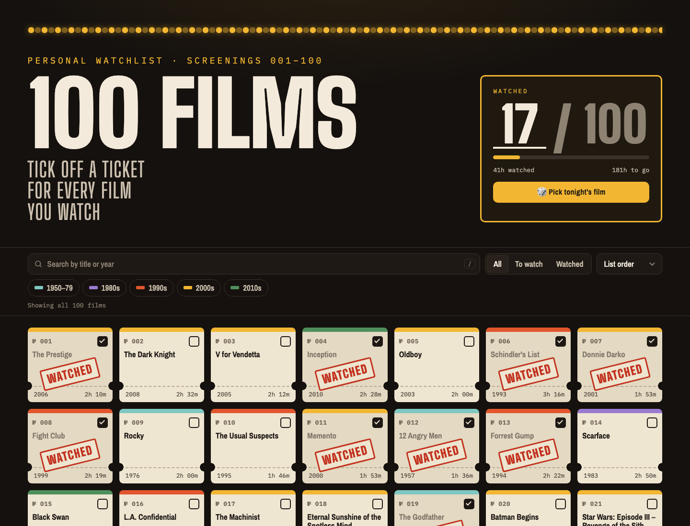

# 🎟️ 100 Films — Watchlist

A personal watchlist of 100 films, styled as a wall of cinema tickets.
Click a ticket to stamp it **WATCHED**, and track your progress.

**▶ Live: [beriltatli.github.io/imdb100](https://beriltatli.github.io/imdb100/)**

[](https://beriltatli.github.io/imdb100/)

## Features

- **Ticket grid** that adapts from wide desktop screens down to phones
- **Progress saved in your browser** (localStorage), kept in sync across open tabs
- **Search** by title or year (<kbd>/</kbd> focuses search, <kbd>Esc</kbd> clears it)
- **Filter** by status (all / to watch / watched) and by era; **sort** by year, runtime or title
- **🎲 Pick tonight's film**: picks a random unwatched film and lights up its ticket
- Progress bar, hours watched and remaining, and a per-era breakdown
- Four accent colors and a two-step reset
- Keyboard and screen-reader friendly; respects `prefers-reduced-motion`

No frameworks, no build step: plain HTML, CSS and JavaScript.

## Project structure

```
.
├── index.html            # Page markup
├── assets/
│   ├── css/style.css     # All styles
│   ├── js/films.js       # The film list (edit this to change the films)
│   ├── js/app.js         # App logic
│   └── img/              # Favicon, social preview image, README screenshot
├── .nojekyll             # Tells GitHub Pages to serve files as-is
└── README.md
```

## Run locally

Open `index.html` in a browser. That's it.

Or serve the folder if you prefer:

```sh
python3 -m http.server 8000
# then open http://localhost:8000
```

## Deployment

The site is served by GitHub Pages from the `main` branch (root folder):
**Settings → Pages → Deploy from a branch → `main` / `/ (root)`**.
Every push to `main` updates [beriltatli.github.io/imdb100](https://beriltatli.github.io/imdb100/) within a minute or two.

### Use it for your own list

1. Fork this repo (or clone it into a new one).
2. Edit `assets/js/films.js` with your films.
3. Enable GitHub Pages as above; your copy is live at `https://beriltatli.github.io/<repo-name>/`.
4. Update the `og:url` and `og:image` URLs in `index.html` so link previews point to your copy.

## Customize

- **Films:** edit `assets/js/films.js`. Each entry is `["Title", year, runtimeInMinutes]`; tickets are numbered in array order.
- **Eras and their colors:** the `ERAS` list in the same file.
- **Accent colors:** the `ACCENTS` list at the top of `assets/js/app.js`.
- **Theme colors:** the CSS variables in `:root` at the top of `assets/css/style.css`.

## Credits

Fonts: [Big Shoulders Display](https://fonts.google.com/specimen/Big+Shoulders+Display),
[Archivo Narrow](https://fonts.google.com/specimen/Archivo+Narrow) and
[IBM Plex Mono](https://fonts.google.com/specimen/IBM+Plex+Mono) via Google Fonts.
